# Penligent

The World's First Agentic Al Hacker. But Built For Cyber Security.

## Quick Links

- **Website**: `https://penligent.ai`
- **Community / Contact (Discord)**: `https://discord.gg/3vxXqvQUX7`

## Get Started

### Install

Recommended: Kali Linux.

#### Windows (x64 only)

1. Double-click the downloaded `penligent.xxx.xxx.exe` file.

2. If a Windows security warning pops up, click **Run anyway**.

#### macOS (ARM only)

1. Double-click the downloaded `penligent.xxx.xxx.dmg` file.

2. Drag the app into the **Applications** folder.

3. Double-click the app to launch.

#### Linux (ARM & AMD compatible)

```bash
sudo dpkg -i penligent.xxx.xxx.deb
```

### Config

For first-time use, you need to configure the required runtime environment.

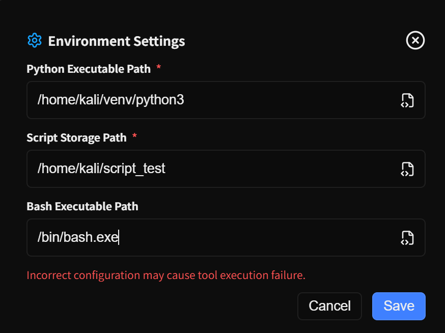

| Parameter | Description | Example Value | Required |
| :--- | :--- | :--- | :--- |
| Python Executable Path | Path to the Python interpreter (virtual environment recommended) | `/usr/bin/python3` | Yes |
| Script Storage Path | Directory for test scripts and workspace | `/Users/xxx/project/` | Yes |
| Bash Executable Path | Path to the Shell interpreter | `/bin/bash` | Yes |

## Run a Pentest

### New Project

Click **New Project** on the left to create a pentest project. Project creation is split into multiple steps to supplement and confirm information.

1. Enter target information and configure task execution options. Fields marked with \* are required. You can select different **Test Type** values based on the task type, allowing the Agent to match different testing strategies.

   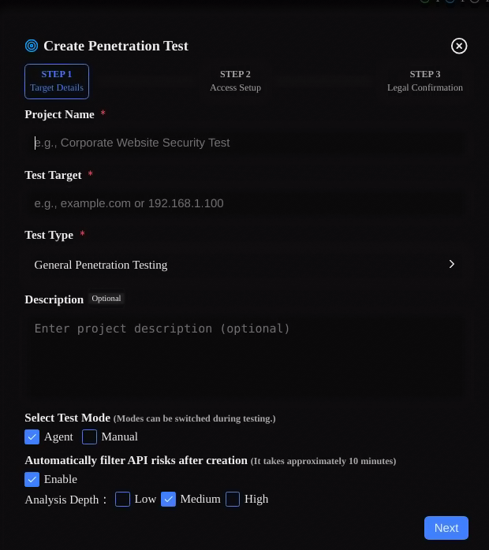

| Element | Description | Required |
| ---- | ---- | ---- |
| Project Name | Unique identifier for the project (supports Chinese/English) | Yes |
| Test Target | Target URL, IP, or IP range for pentesting | Yes |
| Test Type | The type of pentest, such as agent test or general penetration testing | Yes |
| Description | Custom project description or additional notes | No |
| Mode | **Agent Mode**: AI decides strategy; **Manual Mode**: User controls steps | No |
| Automatically Filter API Risks  | Enable to fetch target API interfaces and perform initial scanning | No |
| Analysis Depth | API crawling depth; higher levels offer more comprehensive coverage | No |

2. Optionally provide information that helps accelerate testing, such as credentials and key asset targets.

   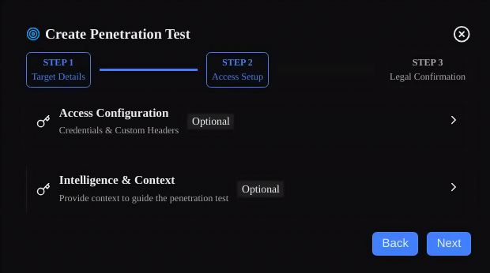

3. Authorization confirmation: confirm that you have compliant authorization for the test target.

   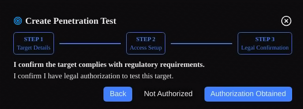

4. If the target of the project you are creating is the same as an existing project, an additional Step 4 will appear, asking whether to import information from the existing project into the current project.

   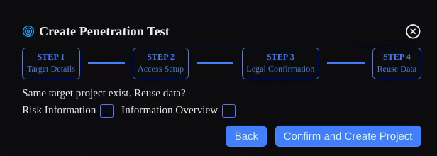

### Pentest Workflow

After you click to create the task, the pentest workflow will begin. The end-to-end pentest process consists of the following steps:

1. Perform initial information gathering and plan the overall pentest approach and route (about 5–10 minutes).

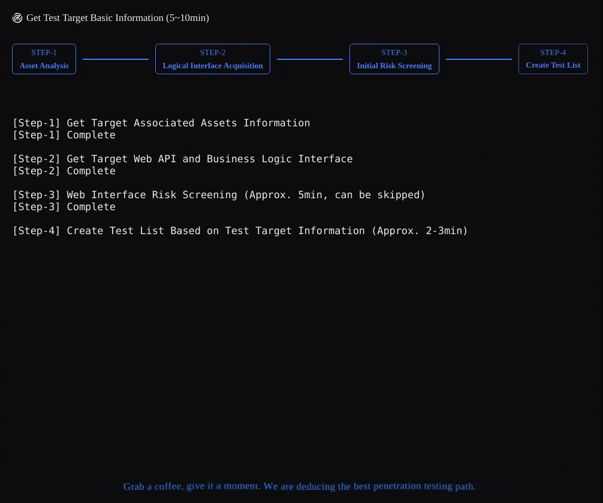

* To start the pentest, we create a testing task list. This list is a baseline checklist. During the pentest, users can edit tasks, delete them, retest, mark as completed, or skip them.

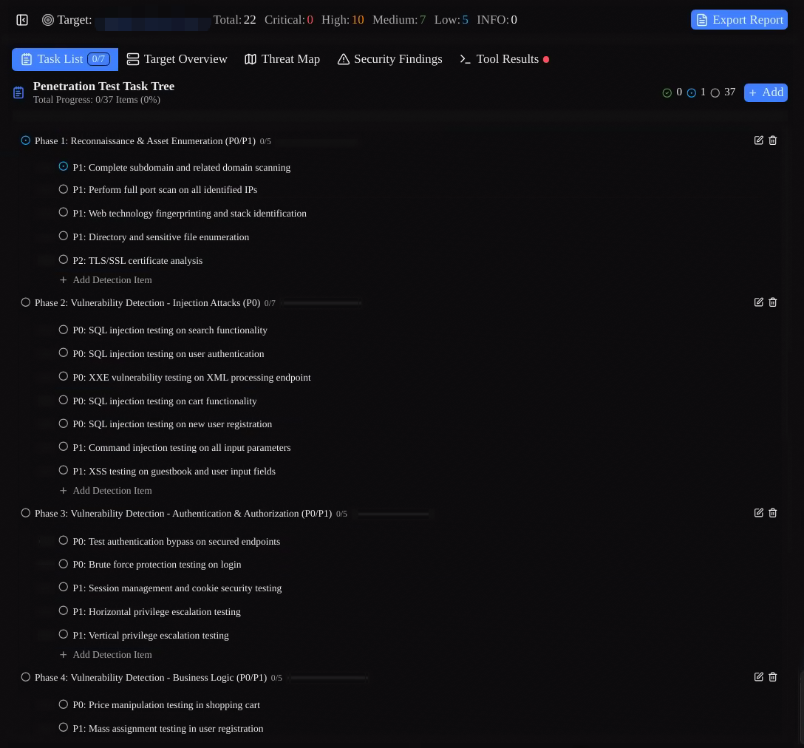

* The overall pentest workflow is controlled in the dialog panel on the right. Users can control the current action by clicking or typing.

### Validate Findings

Discovered risks are recorded in **Security Findings**, and the execution results and evidence chain for each associated tool are consolidated. Users can click **Verify** to re-validate a risk.

1. After you click Verify, Penligent matches the vulnerability type to vulnerability verification techniques and tactics (TTPs), performs at least 3 rounds of verification, and provides the verification result.

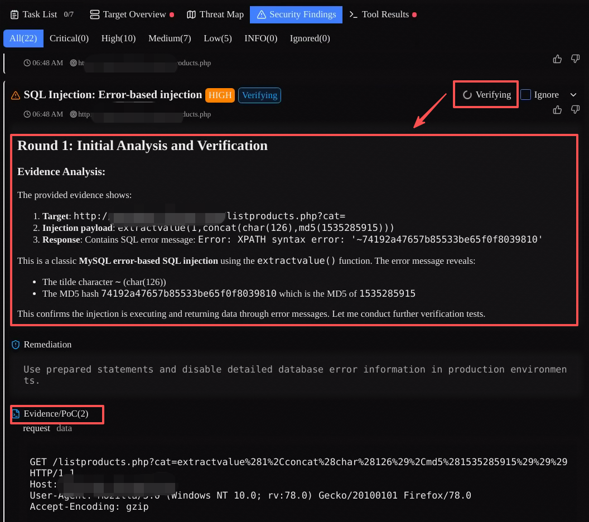

* Penligent has 17 built-in categories of vulnerability verification TTPs, which will be invoked during risk verification. If the current risk cannot be matched to an existing TTP, Penligent will create a new TTP and, after successful verification, store it in the **TTP Library**, where you can view and edit it.

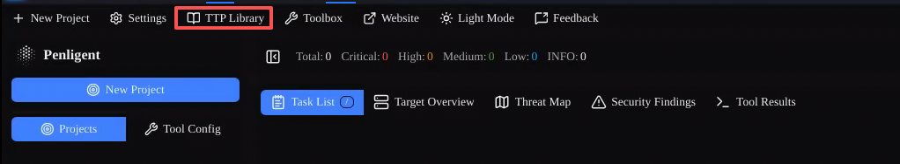

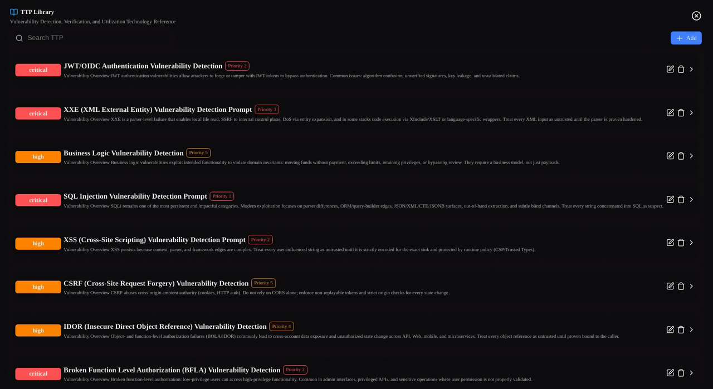

## Reporting

After the project analysis is completed, you can generate a professional penetration testing report.

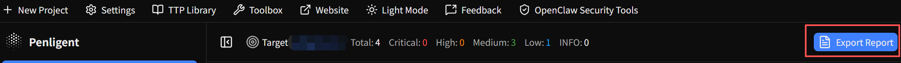

### Generate Report

The system automatically summarizes the analysis results and generates a standardized penetration testing report.

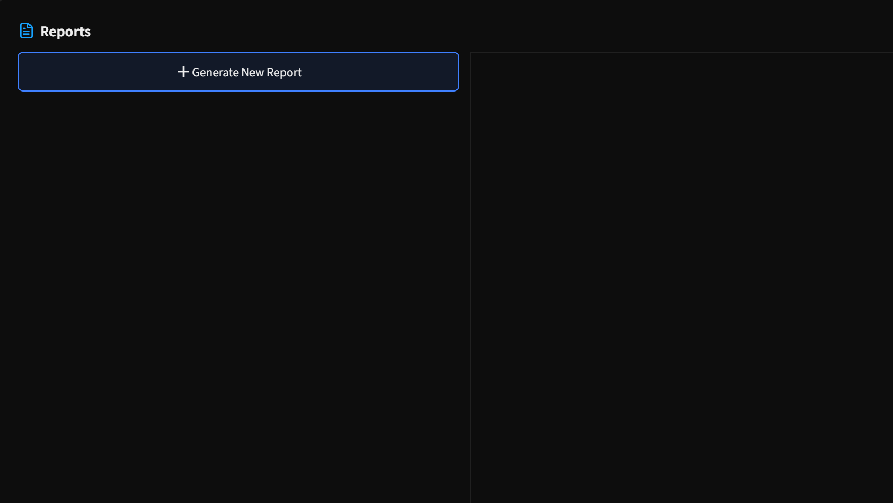

### Edit Report

Online editing is supported. You can add remediation suggestions, adjust risk ratings, and other custom content.

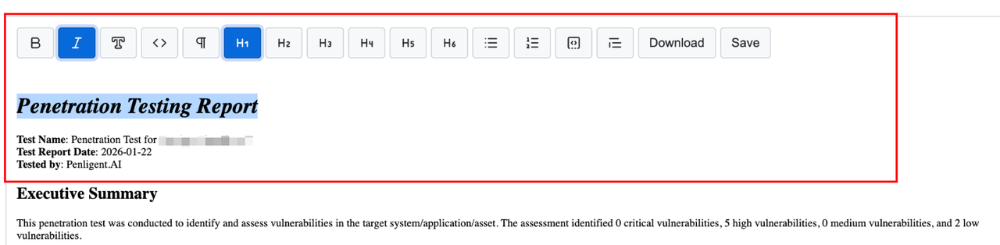

### Export Report

Export is supported in both Markdown and PDF formats.

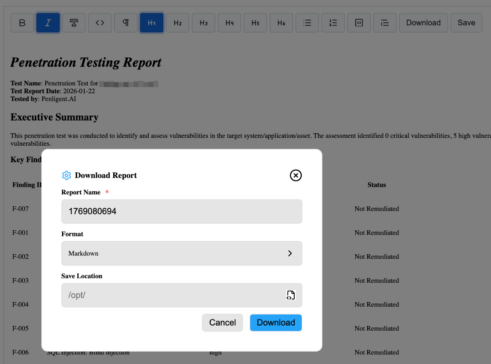

## Other Notes

### (1) Mode Overview

Penligent supports three modes. **Agent / Manual** can be selected when creating a project:

1. **Agent Mode**: Default mode. The system performs the pentest automatically, and the user manually confirms at key points.

2. **Manual Mode**: Manual, step-by-step confirmation. During the process, all tool commands can be edited by the user.

3. **Ask Mode**: Analysis-and-Q&A only. Users can ask questions based on the current pentest tasks and gathered information. In this mode, no tools will be executed.

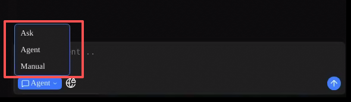

* **Online Search**: In the input box, you can enable online search. When enabled, the system will perform online searches as needed to obtain the latest threat intelligence, vulnerability information, and more.

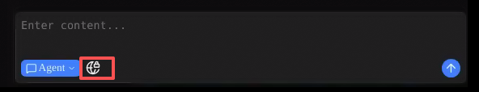

### (2) Main Page Features

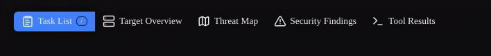

1. **Task List**: Shows the task checklist for the current pentest project. Supports editing, deleting, and switching the active task.

2. **Target Overview**: Full information about the current target, including related assets, network info, Web App info, etc. Any credentials you pre-configured are also shown here.

3. **Threat Map**: A visualization of all weaknesses for the current target, including sensitive paths, critical API endpoints, and discovered risks.

4. **Security Findings**: All security risks found in the current project, grouped by severity (Critical / High / Medium / Low / INFO). You can click **Verify** here to re-validate a risk. Tool execution results and evidence chains associated with each risk are also displayed here.

5. **Tool Results**: Results of all tools executed during the pentest, including commands, raw outputs, and summaries.

### (3) Menu Bar

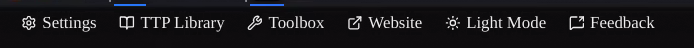

1. **Settings**: Configure the current environment, including Python path, file storage path, etc.

2. **TTP Library**: A list of vulnerability verification techniques and tactics (TTPs).

3. **Toolbox**: Small utilities that pentest engineers may use (more features coming).

4. **Website**: Click to open the official website.

5. **Light Mode / Dark Mode**: Switch between light and dark themes.

6. **Feedback**: If you have any issues, click to send feedback.

### (4) User Center

Click the top-right corner to open the user center, which includes:

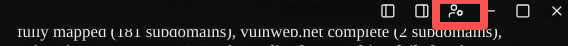

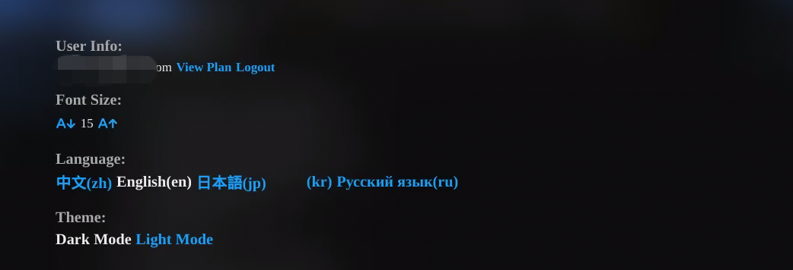

1. **View Plan**: Go to the official website to view the current membership plan and credit consumption.

2. **Login / Logout**: Sign in / sign out.

3. **Font Size**: Adjust overall font size.

4. **Language**: Set the UI language.

5. **Theme**: Configure theme mode.

## FAQ

### Installation Issues

**Q: Windows installation fails with an “insufficient permissions” message?**

> A: Right-click the installer and select **Run as administrator**.

**Q: The application cannot be opened after installation on Linux?**

> A:
1 Do not install the application as the root user in the terminal. Instead, install it using your logged-in user with the sudo command.
2 The issue may be caused by missing dependencies. Install the required dependencies according to the prompt, or install common dependencies using:
```
sudo apt install -f
```

### Login Issues

**Q: Not receiving the verification email?**

> A: 1) Check the spam folder; 2) confirm the email address is correct; 3) try resending.

**Q: The application cannot open the login web page?**

> Check whether the browser was opened but failed to redirect properly.
The issue may be caused by the local network. Try checking or switching your network connection.
You can also try temporarily disabling local IPv6:
sudo sysctl -w net.ipv6.conf.all.disable_ipv6=1
sudo sysctl -w net.ipv6.conf.default.disable_ipv6=1


### Usage Issues

**Q: Scanning is too slow?**

> A: 1) Reduce analysis depth; 2) narrow the testing scope; 3) check network connectivity.

**Q: Report export fails?**

> A: 1) Check disk space; 2) try a different export format; 3) restart the app and try again.
